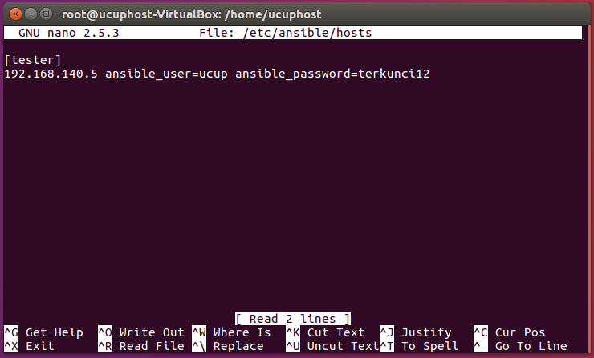
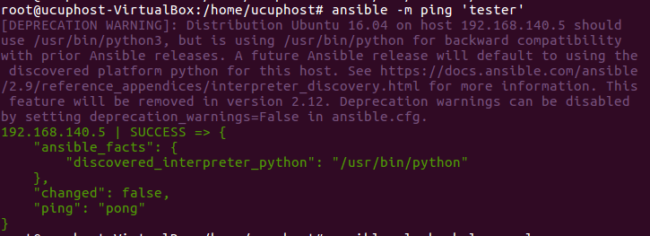
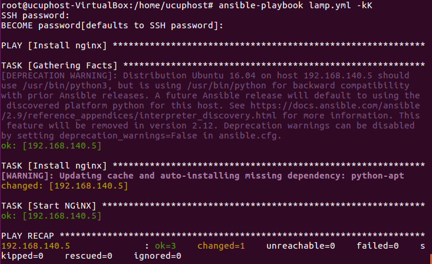
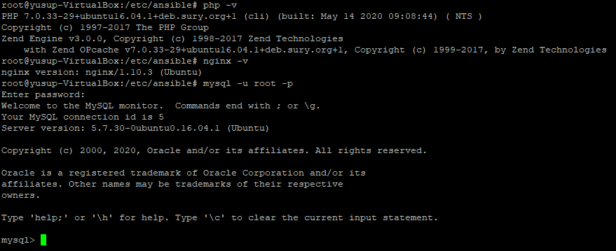

# Instalasi nginx menggunakan ansible
## 1. Install ansible
### A. Melakukan installasi ansible
Berikut command untuk instalasi ansible

    $ sudo apt-get update
    $ sudo apt-get install software-properties-common
    $ sudo apt-add-repository ppa:ansible/ansible
    $ sudo apt-get update
    $ sudo apt-get install ansible

## 2. Menambahkan host 
 Setelah melakukan instalasi ansible, langkah selanjutnya yaitu mendaftarkan host pada ansible, host yang didaftarkan yaitu host server 

    sudo nano/etc/ansible/hosts

selanjutnya melakukan pengujian dengan melakukan ping ke host yang tadi di daftarkan

    ansible all -m ping --ask-pass

Jika berhasil, tampilan nya akan seperti ini

## 3. Menambahkan playbook
selanjutnya adalah menambahkan playbook 

    ---
    - name: Install nginx
      hosts: all
    
      become: true
    
      tasks:
      
      - name: Install nginx
        apt:
          name: nginx
          state: latest
    
      - name: Start NGiNX
        service:
          name: nginx
          state: started
    
    ...

Setelah menambahkan playbook, selanjutnya menjalankan playbook yang sudah dibuat tadi 

    ansible-playbook lamp.yml

selanjutnya melakukan pengecekan apakah aplikasi nya sudah terinstall atau belum
 

