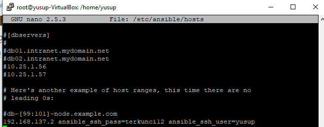

# Instalasi nginx menggunakan ansible
## 1. Install ansible
### A. Melakukan installasi ansible
Berikut command untuk instalasi ansible

    $ sudo apt-get update
    $ sudo apt-get install software-properties-common
    $ sudo apt-add-repository ppa:ansible/ansible
    $ sudo apt-get update
    $ sudo apt-get install ansible

## 2. Menambahkan host 
 Setelah melakukan instalasi ansible, langkah selanjutnya yaitu mendaftarkan host pada ansible, cek ip terlebih dahulu untuk menambahkan host 
  
      ifconfig

setelah mengetahui ip yang akan dijadikan host, selanjutnya mendaftarkan ip nya, dengan command seperti dibawah

    sudo nano/etc/ansible/hosts

selanjutnya melakukan pengujian dengan melakukan ping ke host yang tadi di daftarkan

    ansible all -m ping --ask-pass

Jika berhasil, tampilan nya akan seperti ini

