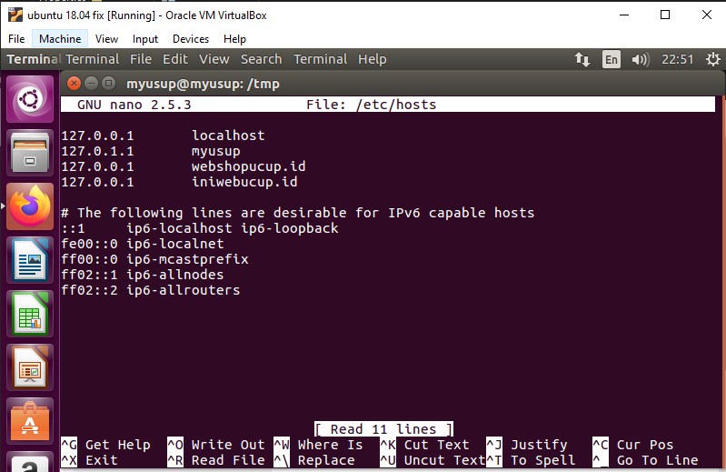

# CARA DEPLOY LARAVEL,WORDPRESS,CODE IGNITER MENGGUNAKAN NGINX PADA UBUNTU

## A. DEPLOY LARAVEL MENGGUNAKAN NGINX PADA UBUNTU 16.04

### 1. Update ubuntu dan lakukan install nginx

    sudo apt update
    sudo apt install nginx
### 2. Install PHP 7.2-FPM dan Module Pendukung

    sudo apt install php7.2-fpm php7.2-mbstring php7.2-xmlrpc php7.2-soap php7.2-gd php7.2-xml php7.2-cli php7.2-zip
### 3. Setelah menginstal PHP, jalankan perintah di bawah ini untuk membuka file default PHP-FPM.

    sudo nano /etc/php/7.2/fpm/php.ini
Kemudian buat perubahan baris berikut di bawah dalam file dan simpan.

    memory_limit = 256M
    upload_max_filesize = 64M
    cgi.fix_pathinfo=0
### 4. Instal Komposer untuk Mengunduh Laravel

    curl -sS https://getcomposer.org/installer | sudo php -- --install-dir=/usr/local/bin --filename=composer
Selanjutnya Ubah ke direktori Laravel dan jalankan perintah di bawah ini untuk mengunduh dan menginstal Laravel untuk proyek yang ingin Anda buat ... beri nama proyek apa pun yang Anda inginkan . Saya membuat dengan nama MyProject .

    cd /var/www/html
    sudo composer create-project laravel/laravel MyProject --prefer-dist
Setelah menjalankan perintah di atas, direktori proyek baru akan dibuat ... Jalankan perintah di bawah ini untuk mengatur izin yang benar untuk direktori itu.

    sudo chown -R www-data:www-data /var/www/html/MyProject/
    sudo chmod -R 755 /var/www/html/MyProject/
###  5. Melakukan Konfigurasi Nginx

    sudo nano /etc/nginx/sites-available/laravel
Kemudian salin dan tempel konten di bawah ini ke dalam file dan simpan. Ganti baris yang disorot dengan nama domain dan lokasi root direktori Anda sendiri.

    server {
        listen 80;
        listen [::]:80;
        root /var/www/html/MyProject/public;
        index  index.php index.html index.htm;
        server_name  webshopucup.id;
    
        location / {
            try_files $uri $uri/ /index.php?$query_string;        
        }
    
      
        location ~ \.php$ {
           include snippets/fastcgi-php.conf;
           fastcgi_pass             unix:/var/run/php/php7.2-fpm.sock;
           fastcgi_param   SCRIPT_FILENAME $document_root$fastcgi_script_name;
        }
    
    }
Save file dan exit.

### 6. Mengaktifkan Laravel
Setelah mengkonfigurasi VirtualHost di atas, aktifkan dengan menjalankan perintah di bawah ini

    sudo ln -s /etc/nginx/sites-available/laravel /etc/nginx/sites-enabled/
### 7. Restart Nginx
Untuk memuat semua pengaturan di atas, restart Nginx dengan menjalankan perintah di bawah ini.

    sudo systemctl restart nginx.service
### 8. Ubah File Host Lokal Untuk Pengujian
Untuk melakukan perubahan pada file host, jalankan perintah dibawah ini :

    sudo nano /etc/hosts

### 9.  Melakukan pengetesan
Kemudian buka browser Anda dan browse ke nama domain server. Anda akan melihat halaman Laravel.
http://webshopucup.id

## B.  DEPLOY WORDPRESS MENGGUNAKAN NGINX PADA UBUNTU 16.04

### 1.Install Nginx HTTP Server
WordPress memerlukan server web dan server web paling populer yang digunakan saat ini adalah Nginx HTTP Server. Jadi, buka dan instal Nginx di Ubuntu dengan menjalankan perintah di bawah ini:

    sudo apt install nginx
### 2. Install MariaDB Database Server
WordPress juga membutuhkan server basis data ... dan server basis data MariaDB adalah tempat yang bagus untuk memulai. Untuk menginstalnya jalankan perintah di bawah ini.

    sudo apt-get install mariadb-server mariadb-client
Selanjutnya jalankan perintah di bawah ini untuk mengamankan server MariaDB dengan membuat kata sandi root dan melarang akses root jarak jauh.

    sudo mysql_secure_installation
Saat diminta, jawab pertanyaan di bawah ini dengan mengikuti panduan ini.
-   Enter current password for root (enter for none): Just press the Enter
-   Set root password? [Y/n]: Y
-   New password: Enter password
-   Re-enter new password: Repeat password
-   Remove anonymous users? [Y/n]: Y
-   Disallow root login remotely? [Y/n]: Y
-   Remove test database and access to it? [Y/n]: Y
-   Reload privilege tables now? [Y/n]: Y

Restart MariaDB server

    sudo systemctl restart mysql.service
### 3.  Install PHP 7.1 and Module Pendukung
WordPress juga membutuhkan PHP. Namun, PHP 7.1 tidak tersedia di repositori default Ubuntu ... untuk menginstalnya, Anda harus mendapatkannya dari repositori pihak ketiga.

Jalankan perintah di bawah ini untuk menambahkan repositori pihak ketiga di bawah ini untuk meningkatkan ke PHP 7.1

    sudo apt-get install software-properties-common
    sudo add-apt-repository ppa:ondrej/php
Then update and upgrade to PHP 7.1

    sudo apt update
Jalankan perintah di bawah ini untuk menginstal PHP 7.1 FPM dan modul terkait.

    sudo apt install php7.1-fpm php7.1-common php7.1-mbstring php7.1-xmlrpc php7.1-soap php7.1-gd php7.1-xml php7.1-intl php7.1-mysql php7.1-cli php7.1-mcrypt php7.1-zip php7.1-curl
Setelah menginstal PHP 7.1, jalankan perintah di bawah ini untuk membuka file default PHP-FPM.

    sudo nano /etc/php/7.1/fpm/php.ini
Kemudian buat perubahan pada baris berikut di bawah dalam file dan simpan. Nilai di bawah adalah pengaturan yang bagus untuk diterapkan di lingkungan Anda.

    file_uploads = On
    allow_url_fopen = On
    memory_limit = 256M
    upload_max_filesize = 100M
    cgi.fix_pathinfo=0
    max_execution_time = 360
    date.timezone = America/Chicago
### 4. Membuat Wordpress Database
Sekarang setelah Anda menginstal semua paket yang diperlukan, lanjutkan di bawah ini untuk mulai mengonfigurasi server. Pertama jalankan perintah di bawah ini untuk membuat database WordPress.

Jalankan perintah di bawah ini untuk masuk ke server database. Saat diminta kata sandi, ketikkan kata sandi root yang Anda buat di atas.

    sudo mysql -u root -p
Kemudian buat database bernama wordpress

    CREATE DATABASE wordpress;
Buat pengguna yang disebut wordpressuser dengan kata sandi baru

    CREATE USER 'wordpressuser'@'localhost' IDENTIFIED BY 'new_password_here';
Kemudian beri pengguna akses penuh ke database.

    GRANT ALL ON wordpress.* TO 'wordpressuser'@'localhost' IDENTIFIED BY 'user_password_here' WITH GRANT OPTION;
Terakhir, Save perubahan dan exit

    FLUSH PRIVILEGES;
    EXIT;
### 5. Download Wordpress
Selanjutnya, kunjungi situs WordPress dan unduh versi terbaru….

Setelah mengunduh, jalankan perintah di bawah ini untuk mengekstrak file yang diunduh dan memindahkannya ke direktori root WordPress baru.

    cd /tmp && wget https://wordpress.org/latest.tar.gz
    tar -zxvf latest.tar.gz
    sudo mv wordpress /var/www/html/wordpress
Kemudian jalankan perintah di bawah ini untuk mengatur izin yang benar agar WordPress berfungsi.

    sudo chown -R www-data:www-data /var/www/html/wordpress/
    sudo chmod -R 755 /var/www/html/wordpress/

### 6. Konfigurasi Nginx HTTP Server
Terakhir, konfigurasikan file konfigurasi situs Apahce2 untuk WordPress. File ini akan mengontrol bagaimana pengguna mengakses konten WordPress. Jalankan perintah di bawah ini untuk membuat file konfigurasi baru yang disebut wordpress

    sudo nano /etc/nginx/sites-available/wordpress 
Kemudian salin dan tempel konten di bawah ini ke dalam file dan simpan. Ganti baris yang disorot dengan nama domain dan lokasi root direktori Anda sendiri.

    server {
        listen 80;
        listen [::]:80;
        root /var/www/html/wordpress;
        index  index.php index.html index.htm;
        server_name  example.com www.example.com;
    
         client_max_body_size 100M;
    
        location / {
            try_files $uri $uri/ /index.php?$args;        
        }
    
        location ~ \.php$ {
        include snippets/fastcgi-php.conf;
        fastcgi_pass             unix:/var/run/php/php7.1-fpm.sock;
        fastcgi_param   SCRIPT_FILENAME $document_root$fastcgi_script_name;
        }
    }
Save dan Exit

### 7. Aktifkan Modul WordPress dan Tulis Ulang
Setelah mengkonfigurasi VirtualHost di atas, aktifkan dengan menjalankan perintah di bawah ini ... perintah juga menonaktifkan PHP7.0 dan mengaktifkan PHP 7.1 untuk Nginx.

    sudo ln -s /etc/nginx/sites-available/wordpress /etc/nginx/sites-enabled/
###  8. Restart Nginx

    sudo systemctl restart nginx.service
### 9. Configure Wordpress
Sekarang setelah Nginx dikonfigurasi, jalankan perintah di bawah ini untuk membuat file WordPress  wp-config.php .

    sudo mv /var/www/html/wordpress/wp-config-sample.php /var/www/html/wordpress/wp-config.php
Kemudian jalankan perintah di bawah ini untuk membuka file konfigurasi WordPress.

    sudo nano /var/www/html/wordpress/wp-config.php

Masukkan teks yang disorot di bawah yang Anda buat untuk database Anda dan simpan. ( DB_NAME,DB_USER,DB_PASSWORD)

    // ** MySQL settings - You can get this info from your web host ** //
    /** The name of the database for WordPress */
    define('DB_NAME', 'wordpress');
    
    /** MySQL database username */
    define('DB_USER', 'wordpressuser');
    
    /** MySQL database password */
    define('DB_PASSWORD', 'user_password_here');
    
    /** MySQL hostname */
    define('DB_HOST', 'localhost');
    
    /** Database Charset to use in creating database tables. */
    define('DB_CHARSET', 'utf8');
    
    /** The Database Collate type. Don't change this if in doubt. */
    define('DB_COLLATE', '');

### 10.Untuk melakukan perubahan pada file host, jalankan perintah dibawah ini :

    sudo nano /etc/hosts
    

Setelah itu, buka browser Anda dan browse ke nama domain Anda untuk meluncurkan wizard konfigurasi WordPress.

Anda akan melihat panduan penyetelan WordPress untuk menyelesaikan. Silakan ikuti wizard dengan hati-hati.

http://iniwebucup.id

## C. DEPLOY CODEIGNITER MENGGUNAKAN NGINX PADA UBUNTU 16.04

### 1. Install PHP 7 Beserta Modulnya

    sudo apt-get -y install php7.0
    sudo sed -i 's/;cgi.fix_pathinfo=1/cgi.fix_pathinfo=0/;' /etc/php/7.0/fpm/php.ini
    sudo systemctl restart php7.0-fpm
### 2. Install Mysql

    mysql_secure_installation
Setelah melakukan install Mysql langkah selanjutnya yaitu membuat database

    create database db;  
    grant all on db.* to 'dbuser'@'localhost' identified by 'dbpass';  
    flush privileges;  
    exit;

Selanjutnya melakukan configurasi pada leafpad /etc/php/7.2/fpm/pool.d/www.conf &>/dev/null
lakukan perubahan pada [ env[HOSTNAME] = $HOSTNAME ] hilangkan ; pada HOSTNAME, PATH,TMP,TMPDIR,TEMP seperti pada gambar dibawah

### 3.  Install Codeigniter
Untuk melakukan install Codeigniter lakukan perintah seperti dibawah

    wget https://github.com/bcit-ci/CodeIgniter/archive/3.1.5.zip  
    unzip 3.1.5.zip
    cp -r CodeIgniter-3.1.5/ /var/www/html/codeigniter
    
Setelah melakukan install Codeigniter, langkah selanjutnya mendaftarkan database yang sudah dibuat tadi pada database.php seperti dibawah

    leafpad /var/www/html/codeigniter/application/config/database.php &>/dev/null

Selanjutnya mendaftarkan domain pada CodeIgniter

     leafpad /var/www/html/codeigniter/application/config/config.php &>/dev/null

Memberi hak ases

    chown -R www-data:www-data /var/www/html/ 
    chmod -R 755 /var/www/html/

### 4. Selanjutnya melakukan setting pada nginx
Copy dari konfigurasi nginx sebelumnya

    sudo cp /etc/nginx/sites-available/iniwebucup.id /etc/nginx/sites-available/iniwebucup2.id

    sudo nano /etc/nginx/sites-available/iniwebucup2.id
Hapus semua isi yang ada didalam file nya lalu copy yang ada dibawah

    server {  
    listen 8080;  
    listen [::]:8080 ipv6only=on;  
      
    Log files for Debugging  
    access_log /var/log/nginx/iniwebucup2-access.log;  
    error_log /var/log/nginx/iniwebucup2-error.log;  
      
    Webroot Directory  
    root /var/www/html/codeigniter/;  
    index index.php index.html index.htm;  
      
    Your Domain Name  
    server_name www.iniwebucup2.id;  
      
    location / {  
    try_files $uri $uri/ /index.php?$query_string;  
    }  
      
    PHP-FPM Configuration Nginx  
    location ~ \.php$ {  
    try_files $uri =404;  
    fastcgi_split_path_info ^(.+\.php)(/.+)$;  
    fastcgi_pass unix:/run/php/php7.2-fpm.sock;  
    fastcgi_index index.php;  
    fastcgi_param SCRIPT_FILENAME $document_root$fastcgi_script_name;  
    include fastcgi_params;  
	    }  
    }

### 5. Daftarkan Domain yang sudah didaftarkan pada Host

    sudo nano /etc/hosts

Selanjutnya restart nginx

    systemctl restart nginx

### 6. Lakukan Pengetesan

Masukan domain yang sudah didaftarkan tadi pada browser, jika berhasil akan seperti gambar dibawah

