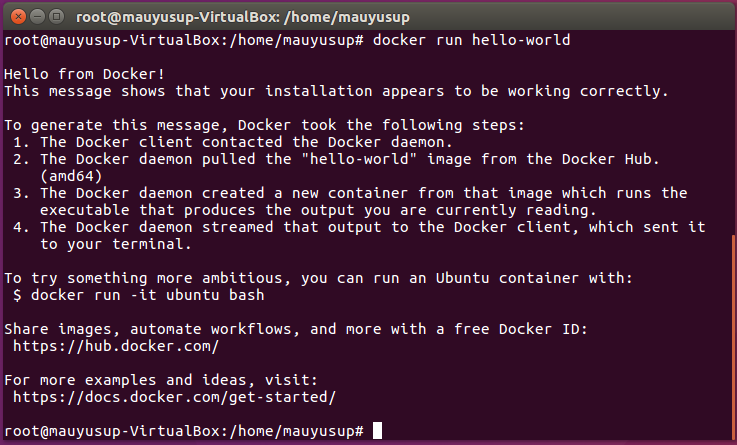
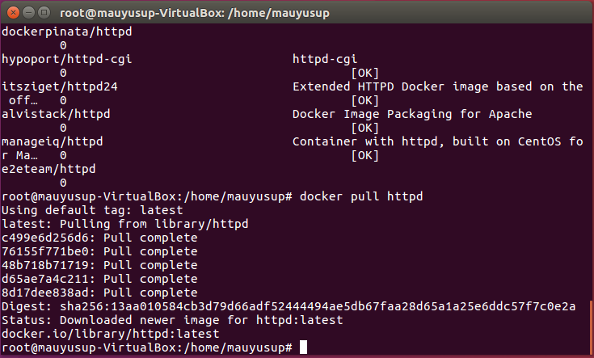
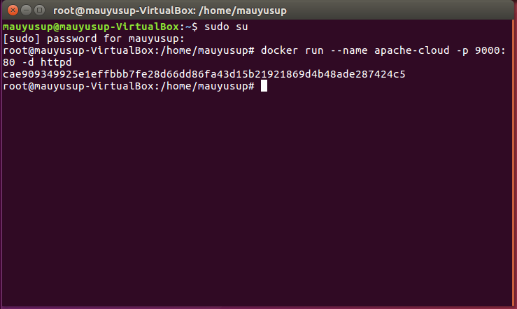
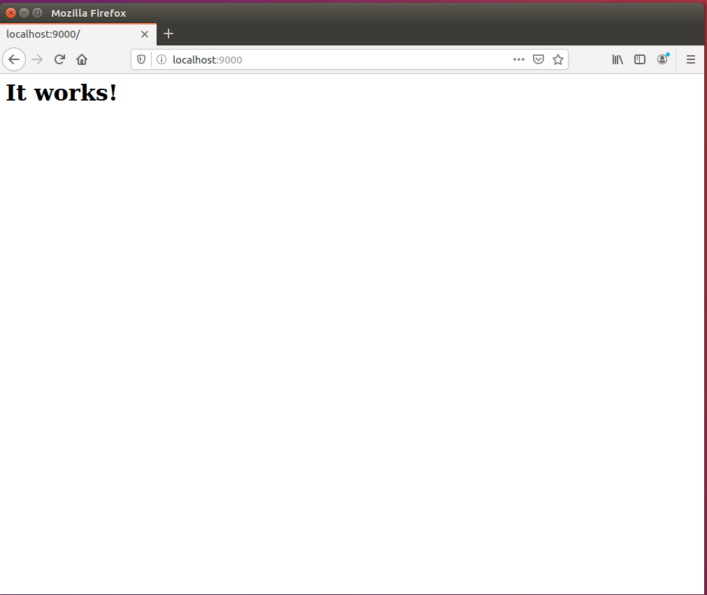
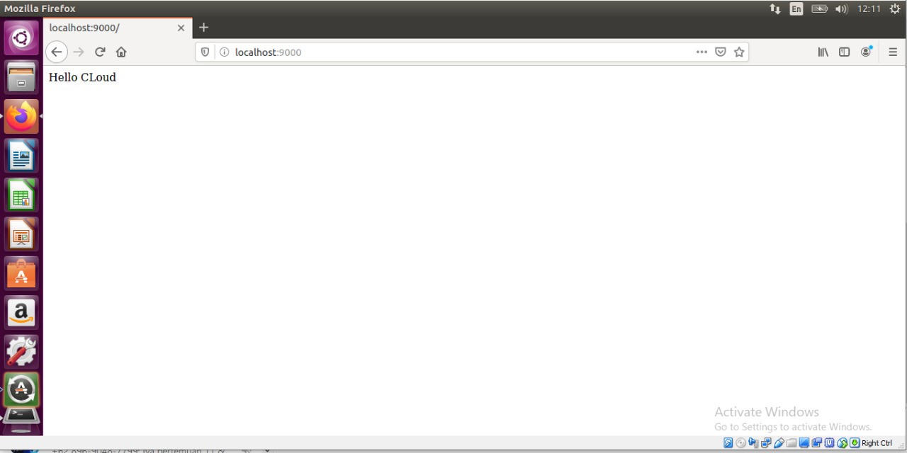
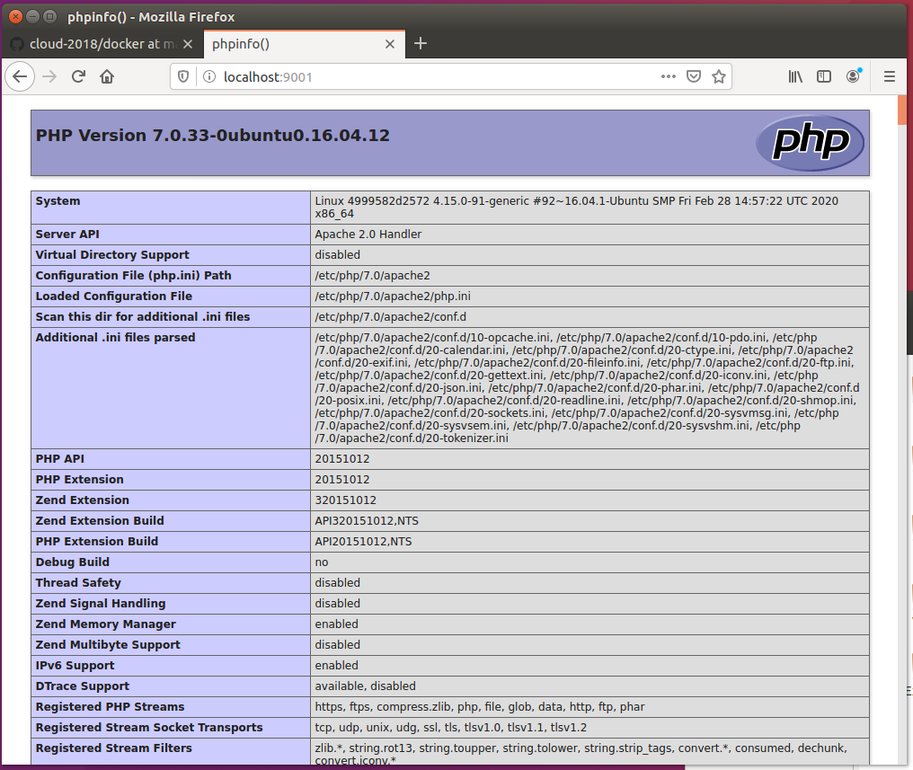

# Docker
### A.  Cek apakah docker sudah terinstall atau belum
    Docker run hello-world
    
    
    
### A.2 Menjalankan aplikasi apache2 sebagai kontainer


#### 1. Mendownload image container

    docker pull httpd
        
    

#### 2. Buat container baru menggunakan base image httpd

    docker run --name apache-cloud -p 9000:80 -d httpd
    
 
 
#### 3. Cek pada browser



### B. Docker Volume
#### 1. Matikan dan hapus kontainer yang sudah dibuat tadi

    docker stop apache-cloud
    docker rm apache-cloud

#### 2. Buat folder baru bernama src dan tambahkan index.html

    mkdir src
    echo "Hello cloud" > src/index.html
#### 3. Jalankan container
```
docker run --name apache-cloud -v "$PWD"/src:/usr/local/apache2/htdocs/ -p 9000:80 -d httpd
```
#### 4. Buka browser dan akses localhost:9000



### C. Dockerfile
#### 1. Buat file www

    mkdir www
#### 2. Buat file index.php didalam foder www

   ```
echo "<?php phpinfo(); ?>" > www/index.php
```
#### 3.  Buat dockerfile dengan isi berikut

    FROM ubuntu:16.04
    
    RUN apt-get update && apt-get install -y apache2 php7.0 php7.0-fpm
    libapache2-mod-php && apt-get clean && rm -rf /var/lib/apt/lists/*
    
    COPY www/index.php /var/www/html
    
    WORKDIR /var/www/html
    RUN rm index.html
    
    WORKDIR /
    
    CMD ["apachectl", "-D", "FOREGROUND"]
    
    EXPOSE 80
#### 4. Buat image dengan perintah

    Docker build -t ubuntu-komputasiawan-images ./
   
   #### 5. Buat container baru dengan perintah
    docker run --name ubuntu-cloud -p 9001:80 -d ubuntu-komputasiawan-images

 #### 6. Cek pada browser localhost:9001
 
 
    

	


 


