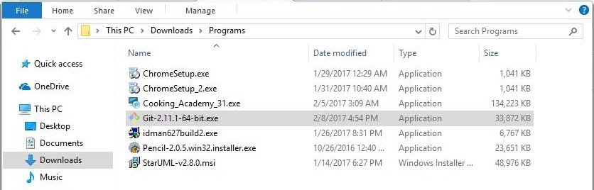

### CARA INSTALL GIT DI WINDOWS
1. Download git pada website resmi nya     git-scm.com kemudian unduh git sesuai dengan arsitektur komputer kita

2. Selanjutnya, klik 2x file installer git yang sudah diunduh

3. Maka akan muncul informasi lisensi git, klik next > untuk melanjutkan

4. Selanjutnya menentukan lokasi instalasi. Biarkan saja apa adanya, kemudian klik Next 

5. Selanjutnya pemilihan komponen, biarkan saja seperti ini kemudian klik Next.

6. Selanjutnya pemlilihan direktori start menu, klik 

7.Selanjutnya pengaturan PATH Environment. Pilih yang tengah agar perintah git dapat di kenali di Command Prompt (CMD). Setelah itu klik Next 

8.Selanjutnya konversi line ending. Biarkan saja seperti ini, kemudian klik Next

9.Selanjutnya pemilihan emulator terminal. Pilih saja yang bawah, kemudian klik 

10.Selanjutnya pemilihan opsi ekstra. Klik saja Next >

11.Selanjutnya pemilihan opsi ekspreimental, langsung saja klik Install untuk memulai 

12.Tunggu beberapa saat, instalasi sedang dilakukan.

13.Setelah selesai, kita bisa langsung klik Finish

14.Selamat, Git sudah terinstal di Windows. Untuk mencobanya, silahkan buka CMD atau PowerShell, kemudian ketik perintah git --version

### MEMBUAT REPOSITORY BARU DI GITHUB
1.Repositori (repository) dalam bahasa indonesia artinya gudang. Repositori merupakan istilah yang digunakan untuk direktori proyek yang menggunakan Git	
Setelah selesai installing git, buat folder baru github.com seperti dibawah, jika sudah selesai klik create Repository

2.Melakukan clone seperti digambar, lalu memindahkan hasil copy tadi ke github bash

3.Buat folder baru pada document, lalu klik kiri pilih git bash

4.lalu pastekan link yang tadi sudah dicopy kedalam git bash, lalu ketik kan [git login "link yg tadi di copy"]

5.lihat di dalam folder yang sudah dibuat, akan ada, folder yang terdapat di github

6.Kembali lagi kedalam gitbash lalu ketik kan [git status] untuk mengecek folder

7.Setelah melakukan edit file, selanjutnya yaitu melakukan penambahan file kedalam github

8.Jika Anda cukup yakin untuk melakukan perubahan langsung di HEAD, Anda langsung gunakan perintah commit. Contohnya:

9.Setelah Anda melakukan commit perubahan (dan sudah yakin siap dikirim ke repository asli), Anda bisa menggunakan perintah push

10.Selanjutnya cek di github apakah sudah berhasil atau belum

