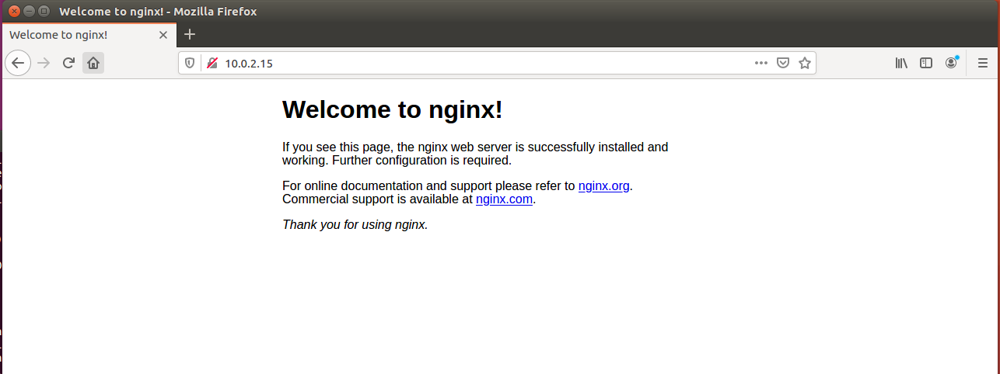
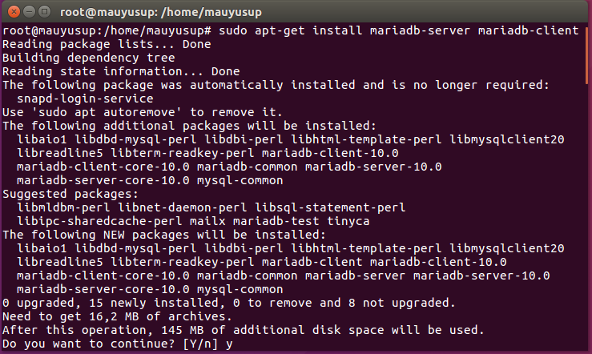
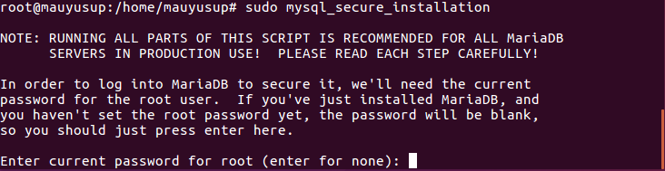
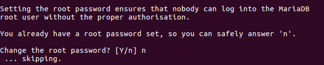
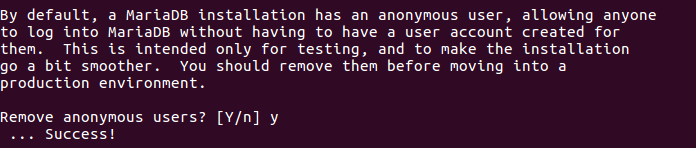
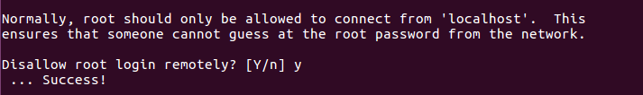
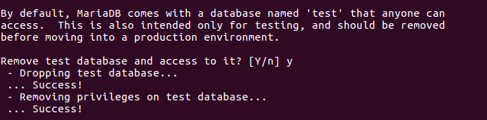
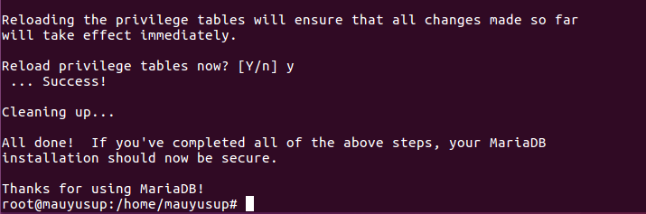
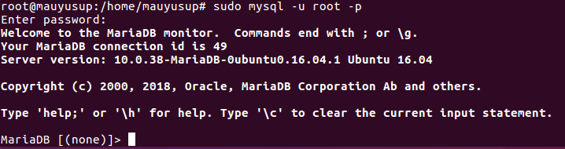

## Menginstall Nginx, Mariadb, PHP (Lemp) di Ubuntu

## A. Menginstall nginx dan memperbarui firewall

### 1. Melakukan update dan upgrade pada ubuntu 
Pertama, yang perlu Anda lakukan adalah meng-update dan upgrade Ubuntu menggunakan perintah berikut :

    sudo apt-get update && apt-get upgrade

### 2. Install Nginx
Kemudian, mulai proses dengan instalasi Nginx menggunakan perintah berikut.

    sudo apt-get install nginx

### 3. Cek instalasi nginx
Setelah proses instalasi Nginx selesai, kini saatnya memastikan bahwa Nginx sudah benar-benar terpasang. Anda dapat melakukan proses pengecekan ini menggunakan browser.
Tuliskan alamat _Internet Protocol (IP)_ pada browser seperti di bawah ini:
*ex : http://ip_anda*

## B. Menginstall Mariadb

### 1. Untuk memulai instalasi MariaDB, gunakan perintah berikut

    sudo apt install mariadb-server

   Perintah ini juga akan menampilkan daftar paket yang akan diinstall bersama dengan jumlah ruang disk yang akan digunakan. Tekan **Y** untuk melanjutkan

### 2. Install skrip keamanan Mariadb
Ketika instalasi selesai, jalankan skrip keamanan. Skrip tersebut akan menghapus beberapa pengaturan default yang tidak aman dan mengunci akses ke sistem database Anda. Masukkan perintah berikut ini untuk menjalankan skrip keamanan

    sudo mysql_secure_installation
Jika perintah tersebut berhasil diaplikasikan, Anda perlu melakukan konfirmasi dalam beberapa tahap. Perintah tersebut akan membawa Anda melalui serangkaian konfirmasi di mana Anda dapat membuat beberapa perubahan pada opsi keamanan MariaDB anda.

#### Pertama, Anda akan diminta untuk memasukkan kata sandi root database saat ini.

#### Kedua, Anda akan ditanya apakah ingin mengganti kata sandi atau tidak. Tekan **n** jika Anda tidak ingin mengganti kata sandi root. Tekan **Y** jika Anda ingin mengubah kata sandi root.

#### Ketiga, Anda akan ditanya apakah ingin menghapus anonymous user di MariaDB. Secara default, siapa pun bisa login ke MariaDB untuk login ke MariaDB, untuk keperluan uji coba. Oleh karena itu, Anda perlu menghapus anonymous user untuk menciptakan environment database yang lebih baik. Klik **Y** untuk menghapus anonymous user di MariaDB.

#### Keempat, Anda akan diminta untuk membatasi akses root dari localhost saja. Ini untuk memperkecil kemungkinan orang lain menebak kata sandi root Anda. Klik **Y** untuk membatasi root di localhost

#### Kelima, Anda akan diminta untuk menghapus database “test”. Anda bisa menghapus database ini karena hanya merupakan database uji coba. Klik **Y** untuk menghapusnya.

#### Terakhir, akan muncul pilihan untuk memuat ulang tabel privilege untuk memastikan bahwa semua perubahan yang dibuat berfungsi. Tekan **Y** pada perintah ini untuk memuat ulang tabel privilege.

Setelah melakukan instalasi mariadb server langkah selanjutnya yaitu melakukan restart mariadb dengan command seperti dibawah :

    sudo mysql -u root -p

Kemudian ketikkan kata sandi yang Anda buat tadi untuk login pada mariadb ... jika berhasil login, tampilan nya akan seperti dibawah :

