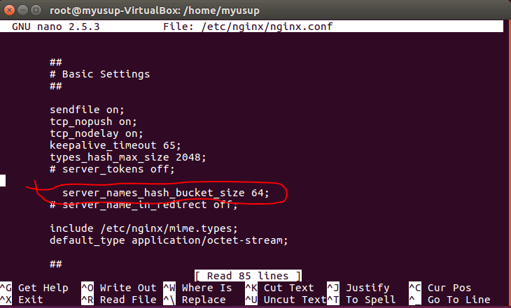
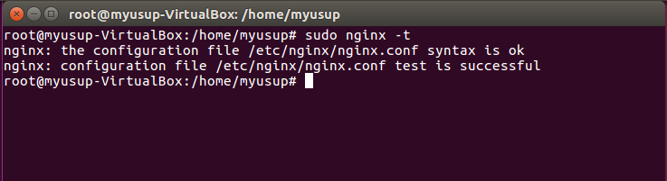
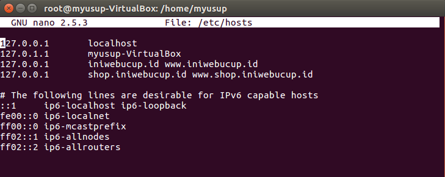
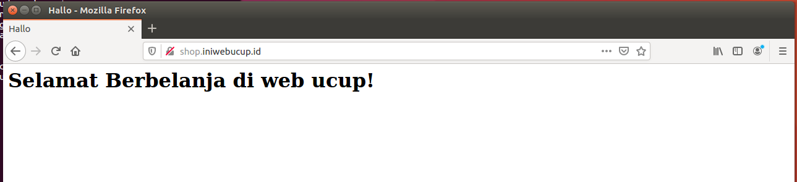
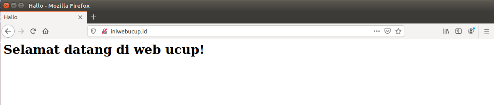

# SETTING SERVER BLOCK NGINX DI UBUNTU 16.04

### A.Syarat
Anda perlu menginstall NGINX di ubuntu server.

### B. Contoh konfigurasi
Untuk tujuan demo, kita akan menyiapkan dua domain yang akan dikonfigurasi di server NGINX. Nama domain yang akan digunakan adalah **iniwebucup.id** dan **shop.iniwebucup.id**.

## Langkah 1 : Mengatur Direktori Root Dokumen
Sekarang kita akan membuat direktori untuk setiap situs web dengan perintah sebagai berikut:

    $ sudo mkdir -p /var/www/iniwebucup.id/html  
    $ sudo mkdir -p /var/www/shop.iniwebucup.id/html
    
Direktori situs web berhasil dibuatkan. Sekarang kita atur izin atau kepemilikian direktori tersebut ke akun pengguna biasa agar dapat mengakses direktori tersebut tanpa sudo.(pastikan Anda tidak masuk sebagai root). Ini akan memudahkan kita membuat dan mengubah konten pada direktori tersebut.

    $ sudo chown -R $USER:$USER /var/www/iniwebucup.id/html  
    $ sudo chown -R $USER:$USER /var/www/shop.iniwebucup.id/html
Soal izin seharusnya sudah benar jika Anda belum mengubah nilau `umask` tetapi kita pastikan dengan mengetik :

    $ sudo chmod -R 755 /var/www
Struktur direktori sudah dikonfigurasi dan kita dapat melanjutkan ke tahap berikutnya.

## Langkah 2 : Buat Halaman Contoh Untuk Setiap Situs Web
Saatnya kita membuat halaman contoh untuk setiap situs web yang sudah dibuat sehingga memiliki halaman yang dapat ditampilkan.

    $ nano /var/www/iniwebucup.id/html/index.html
Dalam file tersebut, kita akan buat konten dasar yang menunjukan situs web apa yang sedang diakses, isi file tersebut dengan:

    <html>
    <head>
        <title>Hallo!</title>
    </head>
    <body>
        <h1>Selamat datang di web ucup!</h1>
    </body>
</html>

Simpan dan tutup editor setelah Anda selesai melakukan perubahan.

Untuk situs kedua pada dasarnya sama. Hanya saja sedikit merubah konten didalamnya. Anda perlu menyalin file tersebut ke direktori situs web yang kedua.

    $ cp /var/www/iniwebucup.id/html/index.html /var/www/shop.iniwebucup.id/html/index.html
Kemudian Anda perlu mengubah sedikit konten didalam file `index.html` di direktori situs web kedua:

    $ nano /var/www/shop.iniwebucup.id/html/index.html
Ubah isi file `index.html` seperti ini:

    <html>
    <head>
        <title>Hallo!</title>
    </head>
    <body>
        <h1>Selamat berbelanja di web ucup!</h1>
    </body>
</html>
Simpan dan tutup setelah Anda selesai melakukan perubahan. Sampai tahap ini, masing-masing situs web memiliki halaman yang dapat ditampilkan.

## Langkah 3: Buat File Server Block Untuk Masing-masing Domain
### Buat File Server Block Pertama: iniwebucup.id
kita akan membuat file server block dengan cara menyalin dari konfigurasi server block `default`.dengan cara seperti dibawah

    $ sudo cp /etc/nginx/sites-available/default /etc/nginx/sites-available/iniwebucup.id
    
Kemudian buka file `/etc/nginx/sites-available/iniwebucup.id` dengan text editor:

    $ sudo nano /etc/nginx/sites-available/iniwebucup.id

Abaikan baris yang dikomentari. Isi file terlihat seperti ini:

    server {
        listen 80 default_server;
        listen [::]:80 default_server;

        root /var/www/html;
        index index.html index.htm index.nginx-debian.html;

        server_name _;

        location / {
                try_files $uri $uri/ =404;
        }
    }

kali ini kita akan membiarkan server block default yang memiliki opsi `default_server`. Jadi kita perlu menghapus opsi default_server di file `/etc/nginx/sites-available/iniwebucup.id`. Isi dari file tersebut dapat diubah seperti ini

    server {
        listen 80;
        listen [::]:80;        
    }

Kita akan mengubah isi file `/etc/nginx/sites-available/iniwebucup.id` untuk menyesuaikan root document ke direktori situs web yang sudah dibuat:

    server {
            listen 80;
            listen [::]:80;
    
            root /var/www/iniwebucup.id/html;
    }

Kita perlu memodifikasi `server_name` agar permintaan dari pengunjung dapat dilayani oleh NGINX

    server {
            listen 80;
            listen [::]:80;
    
            root /var/www/iniwebucup.id/html;
            index index.html index.htm index.nginx-debian.html;
    
            server_name iniwebucup.id www.iniwebucup.id;
    
            location / {
                    try_files $uri $uri/ =404;
            }
    }
    
Simpan dan tutup editor setelah Anda selesai melakukan perubahan
## Langkah 4 Buat File Server Block Kedua: shop.iniwebucup.id

Menyalin konfigurasi server block pertama ( iniwebucup.id ) 

    $ sudo cp /etc/nginx/sites-available/iniwebucup.id /etc/nginx/sites-available/shopiniwebucup.id
    
menyesuaikan konten dari file tersebut dengan membuka editor :

    $ sudo nano /etc/nginx/sites-available/shop.iniwebucup.id

pastikan Anda tidak menambahkan opsi default_server dalam file ini. Sesuaikan seperti berikut ini (simpan dan tutup setelah melakukan perubahan)

    server {
            listen 80;
            listen [::]:80;
    
            root /var/www/shop.iniwebucup.id/html;
            index index.html index.htm index.nginx-debian.html;
    
            server_name shop.iniwebucup.id www.shop.iniwebucup.id;
    
            location / {
                    try_files $uri $uri/ =404;
            }
    }

## Langkah 5: Aktifkan Server Block dan Restart NGINX

Setelah membuat 2 konfigurasi server block situs web, langkah selanjutnya kita perlu mengaktifkan server block tersebut agar dapat diakses oleh pengunjung dengan cara :

$ sudo ln -s /etc/nginx/sites-available/iniwebucup.id /etc/nginx/sites-enabled/  
$ sudo ln -s /etc/nginx/sites-available/shopiniwebucup.id /etc/nginx/sites-enabled/

Untuk menghindari kemungkinan masalah memory hash bucket yang disebabkan oleh penambahan nama server tambahan, kita akan melanjutkan dan menyesuaikan nilai dalam file konfigurasi NGINX `/etc/nginx/nginx.conf`. Buka konfigurasi melalui editor:

    $ sudo nano /etc/nginx/nginx.conf

Dalam file tersebut, temukan konfigurasi `server_names_hash_bucket_size`, kemudian hapus simbol `#` lalu simpan
    

Selanjutnya Anda perlu menguji untuk memastikan tidak ada kesalahan dalam konfigurasi tersebut:

    $ sudo nginx -t
    

Jika tidak ada masalah, restart NGINX untuk menerapkan perubahan konfigurasi.

    $ sudo systemctl restart nginx

## Langkah ke 6: Ubah File Host Lokal Untuk Pengujian 

Untuk melakukan perubahan pada file host, jalankan perintah dibawah ini :

    $ sudo nano /etc/hosts
  
    
Setelah menambahkan host, silahkan lakukan pengujian, dengan mengetikan domain yg tadi sudah didaftarkan 
  
  

